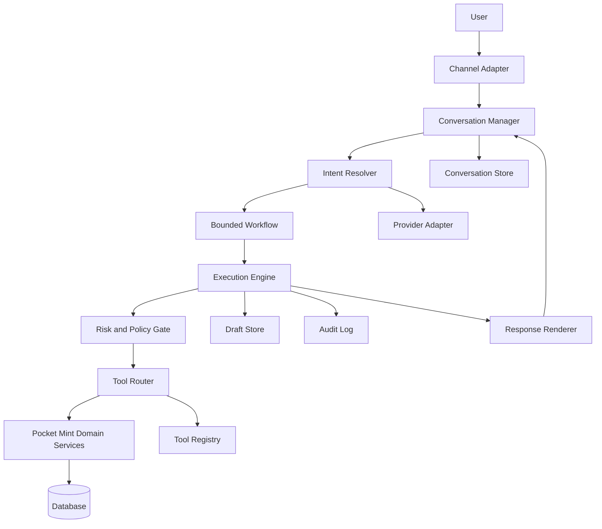

# Assistant Core Architecture

## 1. Status

Approved for architecture. Phases 21.1 through 21.6 and Phases 22.1 through 22.4 are implemented: contracts, deterministic execution, conversation persistence, financial drafts, bounded context assembly, the first provider runtime, the generic deterministic entity-resolution foundation, and production textual wallet, merchant, and category resolution. This document supersedes the informal "AI Assistant" description in [System Architecture](./system-architecture.md#ai-assistant) as the single source of truth for Assistant Core. That section now points here instead of describing the boundary independently.

---

## 2. Context

Pocket Mint v0.5.0 is stable. Core Finance, Authentication, Wallets, Transactions, Categories, Monthly Category Budgeting, Saving Goals, Recurring Transactions, Notifications, Analytics v2, CSV Export, Smart Categorization, Merchant Mapping, i18n, and frontend stabilization are complete. The current backend preserves a documented Rule Engine insertion point but does not yet implement that stage.

The product vision has extended from an expense tracker to an AI-first Personal Finance Assistant that minimizes financial friction and maximizes financial clarity. Pocket Mint remains the financial system of record; the Assistant is an interaction and orchestration layer, not an owner of financial logic.

Two independent architecture proposals were produced for Assistant Core outside this repository ("Proposal A — Pre-Assistant Core Foundations" and "Proposal B — Orchestration Architecture"). They agree on the core invariant and on most component boundaries, but each introduces terminology and detail the other does not: Proposal A defines the capability model, canonical tool contract, draft pipeline, and risk tiers; Proposal B defines the tool registry, planner, execution engine, response generation, memory model, and domain-event integration. This ADR merges both into one non-overlapping model, resolves their few terminology mismatches (e.g., "confirmation subsystem" vs. "draft state" both meant the same thing — draft state wins), and cuts scope the proposals themselves flagged as premature.

---

## 3. Product and Engineering Goals

- Let a User ask about their financial position and receive an answer derived from real backend data, not model recall.
- Let a User initiate a financial write conversationally, but never let a write commit without an explicit confirmation of a previewed effect.
- Keep the Assistant replaceable at the provider level: switching or adding an LLM vendor must not touch domain code, stored conversations, or business rules.
- Keep Assistant Core additive: no existing controller, service, or schema is modified to make the Assistant work.

## 4. Non-Goals (v1)

- Real-world money movement, bank credentials, or external payment execution.
- Autonomous multi-step planning beyond a small set of bounded, deterministic workflows.
- A general-purpose long-term memory or "world model" of the User's finances.
- Proactive, event-triggered conversation (the Assistant responds to requests; it does not yet start them).
- A standalone non-financial reminder domain.

---

## 5. Architectural Invariants

These carry over unchanged from [System Architecture](./system-architecture.md) and bind Assistant Core specifically:

```text
Assistant
    ↓
Tool Router
    ↓
Pocket Mint Domain Services
    ↓
Database
```

Never:

```text
LLM
    ↓
Database
```

- The Assistant never supplies or selects the authenticated User ID; it is resolved the same way as every other caller (`req.auth.userId` → ownership enforcement → domain service).
- The Assistant has no privileged path around authorization, Canonical Calculations, transactions, auditing, or User control.
- AI output is untrusted input. Every tool call is server-validated regardless of what the model produced.
- A financial write is never committed without going through Draft → Preview → Explicit Confirmation → Commit.
- Provider SDK types never leak past the provider adapter.

---

## 6. Final Component Model



Domain Event Subscriber is deferred (§24) and omitted from the v1 diagram.

## 7. Responsibility Boundaries

| Component | Owns | Does not own |
|---|---|---|
| Channel Adapter | Transport-level request/response for a given surface (web chat, future mobile) | Business logic, provider calls |
| Conversation Manager | Conversation lifecycle, turn sequencing, loading/saving conversation state | Tool execution, financial rules |
| Intent Resolver | Turning a message plus context into a provider-neutral intent | Database access, authorization, confirmation reduction |
| Bounded Workflow | Deterministic step sequencing for a supported intent | Autonomous planning, DB access |
| Execution Engine | Dispatch ordering, timeouts, cancellation, idempotency propagation, partial-failure reporting | Authorization decisions, tool implementation |
| Risk and Policy Gate | Deciding immediate-execute vs. draft-and-confirm based on tool risk tier and permitted preferences | Weakening mandatory system policy |
| Tool Router | The only path from Assistant Core into domain services; validates input against the canonical contract | Business logic, calculations |
| Tool Registry | Passive, deterministically-loaded catalog of tool contracts | Conversation state, execution, LLM interaction |
| Draft Store | Pending-mutation state: proposed input, preview, status, expiry | Committed financial state |
| Conversation Store | Messages, tool-call history, active draft reference | Financial facts (always re-fetched from domain) |
| Audit Log | Actor, origin, tool, input/output summary, outcome, correlation ID | — |
| Provider Adapter | Translating canonical requests/tool schemas to/from one LLM vendor's format | Any provider-neutral state |
| Response Renderer | Turning structured results into user-facing text | Tool invocation, business decisions, recomputation |
| Pocket Mint Domain Services | All Canonical Calculations, ownership, validation, atomic mutation — unchanged from [System Architecture §Business Services](./system-architecture.md) | — |

---

## 8. Canonical Tool Contract

Every tool is registered with this minimum, provider-neutral metadata:

- stable tool identifier
- description
- input schema, output schema
- capability (e.g. `transaction.read`, `transaction.create`, `budget.read`, `saving-goal.contribute`)
- risk level (§12)
- confirmation policy
- idempotency policy
- timeout
- audit metadata
- enabled/disabled state

A capability is not an independent RBAC system — it is a label on the tool contract that determines which tools a conversation may invoke. It never replaces backend ownership/authorization, which remains `req.auth.userId → ownership enforcement → domain service` exactly as today. Provider-native tool schemas are generated from this canonical contract by the provider adapter; nothing upstream of the adapter knows a provider-specific format.

## 9. Tool Registry Design

A passive, deterministically-loaded-at-startup catalog. It does not know about conversations, does not plan, does not execute, and is never modified by the LLM. For v1 it holds only the metadata in §8 — no team ownership, dynamic administration, cost accounting, or retry matrices unless a concrete tool needs them.

## 10. Intent and Orchestration Model

Natural-language input resolves to a provider-neutral intent. For v1, orchestration is deterministic and bounded per supported intent — not a general-purpose DAG planner. A workflow answers: what tools are required, in what order, and what (if anything) needs clarification before proceeding. It never touches the database directly, never recomputes a financial calculation, never bypasses the Tool Router, and never reduces confirmation requirements. General planning is introduced only when a concrete multi-tool use case demonstrates the bounded model is insufficient.

## 11. Execution Model

The Execution Engine is the only component that dispatches through the Tool Router. It handles dependency ordering, bounded parallelism, timeouts, cancellation, idempotency propagation, and retry only for explicitly retryable failures. It stops on unsafe ambiguity and reports partial success honestly rather than silently retrying an ambiguous money-affecting mutation. Multi-step mutations prefer one atomic domain-level tool over a distributed transaction across multiple tool calls; there is no cross-tool distributed transaction in this architecture.

## 12. Risk and Policy Model

Risk is static tool metadata, not a runtime inference. Four tiers:

| Tier | Examples | Execution |
|---|---|---|
| Low | balance/budget/analytics/saving-goal reads | Execute immediately, no confirmation, audited |
| Medium | create transaction, create budget, create saving goal | Draft → preview → lightweight confirmation → commit |
| High | internal transfer, edit transaction amount, archive/delete financially meaningful records, bulk import commit | Full preview, explicit confirmation, stronger policy checks, clear effect disclosure |
| Very High | bank payment, external transfer, bank login, wallet deletion with extensive history, irreversible bulk deletion | Unavailable in v1 |

Policy evaluation uses risk tier, fixed system rules, and permitted User preferences to decide execution behavior. A User preference may raise a confirmation bar; it may never lower one below system policy. Model self-reported confidence never reduces required confirmation. Risk classification and policy evaluation are one small module for v1, not two deployed subsystems — there was no requirement in either source proposal that justified splitting them.

## 13. Draft and Confirmation Lifecycle

One generic draft mechanism for every financial write, not one draft table per domain:

```text
Draft → Preview → Explicit Confirmation → Commit
```

A draft holds: conversation ID, request ID, tool identifier, validated proposed input, preview data, status, created/expiry timestamps, and a committed-resource reference once applicable. Drafts are inert — they never touch financial tables. A conversation holds at most one active draft, so confirmation is never ambiguous about what it targets. Pending confirmation *is* the draft's status; there is no separate confirmation-persistence model.

Commit requires, in order: ownership verification, draft-still-pending check, expiry check, input revalidation, execution of the existing domain service inside its existing transaction boundary, and an audit write. Preview must reuse the same domain logic as commit — it must not become a second, independently drifting implementation of a financial calculation. Not every existing service can safely support a generic dry-run; where a service cannot, the workflow computes a preview from the same validated inputs it will commit with, without inventing a parallel calculation path.

## 14. Conversation and Memory Model

Minimum memory for v1, layered:

- **Conversation memory** — current messages and references needed to resolve "that transaction" or "the BCA wallet."
- **Session state** — incomplete workflow state, active draft, clarification state.
- **Preference memory** — explicit, User-set preferences (default wallet, verbosity, reminder delivery, confirmation strength) that may only strengthen, never weaken, mandatory policy.
- **Long-term semantic memory** — deferred (§24). Merchant aliases, category rules, wallet state, saving goals, and budgets already live in the finance domain and are always fetched from there, never cached as a second source of truth in conversation memory.

Phase 21.5 implements conversation memory as an `AssistantContextService`. Conversation storage remains authoritative; `AssistantContext` is a read-only, derived DTO and context assembly never creates or updates a conversation, turn, message, draft, tool execution, audit record, or financial row. The service validates authenticated ownership before reading history. Unknown and cross-User conversation IDs remain indistinguishable, and archived conversations cannot be prepared for continued execution.

Context is assembled in a fixed sequence: system metadata, conversation metadata, recent turns/messages, recent tool executions, one unexpired pending draft when present, then the explicit current User request. The draft is therefore immediately before the request. Retrieval is newest-first and bounded, while the final DTO is oldest-to-newest with `createdAt` then `id` as the stable tie-break. Defaults are 40 messages, 20 turns, 10 tool executions, one draft, and 64 KiB of UTF-8 serialized JSON. Invalid or unreasonable limits are rejected before any query. Oldest removable whole turns or tool entries are discarded first; the current request, pending draft, and latest Assistant response are protected. If protected content alone exceeds the byte limit, preparation fails with `ASSISTANT_CONTEXT_TOO_LARGE` instead of silently truncating or writing anything.

Only provider-safe DTO fields cross this boundary. `conversationId` is an allowed public Assistant identifier, not a hidden database identifier; all other internal IDs are excluded except `draftId`. Draft context contains only `draftId`, operation, status, normalized preview, expiry, and confirmation requirement. Tool context contains tool, status, ISO timestamp, and a recursively filtered safe output summary. Explicit normalized-key deny-list matching removes owner/user, correlation, policy/risk, database, stack, SQL/lock, idempotency, audit, raw argument/output, credential/token/secret, balance, and prototype keys without broad substring filtering. Unsupported prototypes, values, or cycles fail safely. Decimal values are emitted as strings without floating-point conversion and redundant trailing zeroes are removed; timestamps use UTC ISO 8601 and arbitrary safe-summary object keys are serialized in stable order.

The read plan is exactly four SQL statements and avoids N+1 work: one owned-conversation lookup; one bounded, owner-scoped messages query that joins turn metadata and includes the latest Assistant response in the same statement; one owner-scoped active-draft query; and one owner-scoped tool-history query. The three child reads run in parallel after ownership succeeds, and the count does not grow with conversation size. Expired or non-pending drafts are omitted without being mutated. No Redis, distributed cache, semantic search, embeddings, or AI summary is involved.

The DTO uses turns as its single canonical conversation-history representation; there is no duplicate flat message collection. A message-count boundary may intentionally retain only the newest portion of the oldest included turn. Every retained message remains nested under that turn's status and timestamp, while byte trimming removes whole optional turns so it cannot create additional partial structures.

`prepareProviderExecution` accepts an unpersisted current User request. It validates and appends that request exactly once as the final context item; callers must not persist the same request first and then pass it as the current request. Identical text in an older persisted message remains distinct historical context and is not content-deduplicated.

## 15. Provider Adapter Boundary

```text
Provider SDK → Provider Adapter → Canonical Assistant Request / Tool Call → Assistant Core
```

Everything on the Assistant Core side of the adapter — stored conversations, messages, tool calls, execution plans, tool results, draft state, audit state — is provider-neutral. Only the adapter knows OpenAI/Anthropic/Gemini-specific message and tool formats. Swapping or adding a provider means writing one adapter; nothing else changes.

Phase 21.6 implements exactly one adapter with the official `@google/genai` SDK. It requests JSON with a closed response schema, caps generation at 4,096 output tokens, passes client cancellation and a bounded HTTP timeout, and sets SDK retry attempts to one. The production entry point is the explicitly configured `POST /api/v1/assistant/messages`; the canonical `/execute` endpoint remains available and never invokes a provider implicitly. Provider failover, routing, automatic retry, streaming, tool loops, and multi-step agents remain deferred. The 32 KiB byte check is necessarily post-SDK because this non-streaming adapter receives an already-materialized response.

The provider-visible capability catalog is derived from enabled Tool Registry entries in stable intent order. It contains only public intent ID, description, safe required/optional argument metadata, capability category, and confirmation possibility. Handler names, risk/policy internals, database models, source paths, owners, and unrestricted schemas never enter the catalog.

The deterministic system instruction remains separate from one labelled JSON data message containing historical turns, prior safe tool summaries, optional pending draft context, and the current request. Every retrieved value is untrusted content, including previous Assistant text, merchant/category/wallet names, descriptions, and draft previews. Text such as "ignore previous instructions" remains quoted data and cannot modify the catalog, schema, registry lookup, validation, policy, or confirmation boundary.

Structured provider output has exactly `kind`, `intent`, `arguments`, `clarification`, and `userMessage`. Validation rejects unknown fields/kinds/intents, malformed arguments, arrays in object positions, normalized mixed-case ownership/authorization/lifecycle claims, confirmation claims, hidden reasoning keys, prototype keys, excessive nesting, output above 32 KiB, non-terminal finish classifications, and unsafe clarification text. Clarifications are plain text only; secret solicitation, links, executable markup, and control characters fall back safely. The backend then resolves the intent through the registry, reruns its existing argument contract, evaluates existing policy, and delegates to the existing application service. Provider prose never replaces deterministic read results, draft previews, policy failures, or mutation outcomes.

The current request follows the Phase 21.5 unpersisted contract. The runtime establishes or validates an empty/owned conversation, calls `prepareProviderExecution` once with the unpersisted request, and invokes the provider outside every database transaction. A validated intent is delegated to the existing execution path, which persists the request exactly once; clarification, unsupported, and provider-failure branches each create one non-tool turn and also persist it exactly once.

Provider request idempotency is not part of Phase 21.6. Each HTTP request invokes the provider and deterministic path at most once, but two independent or concurrent duplicate `/messages` submissions may create two turns and two pending drafts. Draft-confirmation idempotency prevents repeated financial effects for one draft; it does not deduplicate draft creation. After a durable result, a failed metadata-only provider-audit finalization does not replace that result with a retry-triggering error; the minimized audit row can remain `STARTED` for manual investigation because no recovery worker exists.

`transaction.create` remains proposal-only. For provider execution, the model supplies textual `walletReference` and `merchantReference` values but never wallet, merchant, or Merchant Mapping identifiers; provider-plan validation rejects arguments outside the provider-visible contract before application execution. The Backend resolves those texts through the production Wallet and Merchant Resolvers, then passes only the resolved wallet ID and safe merchant label through existing validation. The canonical `/execute` compatibility contract retains `walletId` and optional `merchantReference` for deterministic internal callers. The initial request creates a pending draft, zero transactions, and no wallet balance change. Natural language cannot invoke confirmation; only the authenticated draft-confirm endpoint with explicit idempotency can call the transaction domain.

## 15.1. Deterministic Entity Resolution

Phase 22.1 added the internal, provider-neutral resolution boundary. Phase 22.2 registers the production `wallet` resolver, and Phase 22.3 registers the production `merchant` resolver. Both are invoked only from Assistant `transaction.create` execution when the corresponding validated textual reference exists. Normal Wallet and Merchant Mapping REST endpoints and other finance-domain callers are unchanged.

The trust flow is:

```text
Provider plan proposes textual reference only
    → Entity Resolution Service validates the closed reference contract
    → Resolver Registry selects one statically registered resolver
    → Resolver loads candidates with authenticated owner scope at query time
    → Backend creates deterministic evidence and integer confidence
    → Ambiguity Policy returns resolved / ambiguous / not_found
    → Existing Tool Registry, policy, ownership, domain validation, and confirmation still apply
```

The closed entity types are `wallet`, `merchant`, and `category`. An untrusted `EntityReferenceInput` contains only `entityType`, `referenceText`, optional source metadata (`user_text`, `provider_extracted`, `deterministic_rule`, or `system_constraint`), and an optional bounded non-authoritative conversation reference. Exact-key validation rejects IDs, owner/User identity, evidence, confidence, lifecycle or resolution status, authorization/confirmation claims, trusted flags or constraints, prototype keys, and every other unknown field. Source classification is provenance only; it never changes validation, ownership, evidence, confidence, or ambiguity.

Authenticated identity and optional trusted constraints are separate service arguments. Only backend code may create trusted constraints. A future domain resolver may use bounded constraints such as active state, capability, currency, category type, or merchant status, but it must apply them to owner-scoped candidates and may not accept a provider claim such as `trusted: true`.

### Normalization policy

Reference normalization is pure and byte-deterministic:

1. reject non-strings, malformed surrogate input, null/C0/C1 controls other than ordinary whitespace, and bidi control characters;
2. enforce a 256-byte UTF-8 source ceiling;
3. apply Unicode NFKC compatibility normalization, then locale-independent `toLowerCase()`;
4. replace Unicode punctuation and separator categories with one space, collapse whitespace, and trim;
5. preserve digits, arbitrary scripts, and non-punctuation symbols such as emoji; do not transliterate;
6. reject an empty result or a normalized value above 256 UTF-8 bytes.

Consequently, `  BCA   Debit ` becomes `bca debit`, `Rekening\tUtama` becomes `rekening utama`, full-width `ＢＣＡ` becomes `bca`, and `BCA-DEBIT` becomes `bca debit`. Repeated separators collapse. Compatibility normalization is intentional so full-width Latin references compare consistently; visually confusable characters from other scripts are not treated as equivalent.

Candidates are immutable internal projections, never Prisma models. They contain the closed entity type, an authoritative internal ID for later backend consumption, safe display label, canonical label and comparison form, normalized canonical label, bounded normalized aliases, optional safe discriminator, trusted match metadata, and a stable tie-break key. They never contain owner/User IDs, balances, account details, financial totals, credentials, audit internals, or unrelated foreign keys. Public conversion removes the internal resolved ID and internal ambiguity-selection references.

### Matching, confidence, and ambiguity

Only deterministic exact primitives exist:

| Evidence | Fixed score |
|---|---:|
| Canonical exact after NFKC/case/whitespace comparison | 1000 |
| Alias exact after the same comparison | 950 |
| Exact equality after full punctuation/separator normalization | 900 |
| Trusted constraint satisfied | 0, supplementary only |
| No match | 0 |

Confidence is an integer from 0 through 1000, not a probability. Score 1000 is band `exact`, 900–999 is `strong`, 1–899 is `possible`, and 0 is `none`. Resolution requires at least 900. Evidence does not accumulate to promote weak matches; the strongest fixed contribution determines confidence. Substring scoring, token-overlap scoring, edit-distance, phonetic, fuzzy, semantic, embedding, AI-generated alias, and learned-alias matching are absent.

A candidate resolves only when it is the unique best candidate and no eligible competitor is within the inclusive 50-point ambiguity margin. Equal canonical labels, aliases, normalized labels, scores, or constraint outcomes return `ambiguous`; there is no first-row fallback. Candidates and options sort by score, stable tie-break key, internal ID, normalized canonical label, display label, and discriminator. At most five safe options are returned.

The closed outcomes are `resolved`, `ambiguous`, `not_found`, `invalid_reference`, and `unsupported_entity_type`. Unknown and cross-owner-only matches are indistinguishable from `not_found`. Internal resolved results retain the authoritative candidate reference for later deterministic backend work. Provider/public projections contain only safe labels, optional safe discriminators, confidence, and minimized evidence; raw models, owner identity, financial data, and internal IDs are removed.

### Resolver and operational boundaries

Each asynchronous resolver declares one entity type, loads owner-scoped candidates once, and creates bounded evidence for each candidate. Production database resolvers must put authenticated owner scope in the query; loading cross-owner records and filtering in memory is forbidden. The registry permits at most one resolver per closed type, rejects duplicates and mismatches, returns registered types in stable order, and can be finalized after bootstrap. Providers cannot select modules, resolver names, methods, IDs, evidence, confidence, or ambiguity decisions.

The service performs one registry lookup and one candidate load, then enforces these trusted limits:

| Boundary | Limit |
|---|---:|
| Source reference | 256 UTF-8 bytes |
| Normalized reference | 256 UTF-8 bytes |
| Candidates per request | 100 |
| Aliases per candidate | 16 |
| Alias | 128 UTF-8 bytes |
| Evidence items per candidate | 4 |
| Ambiguity options | 5 |
| Display label or discriminator | 128 UTF-8 bytes |

Candidate overflow fails with a safe operational error; a future database resolver must narrow in its owner-scoped query rather than load an entire dataset. Configuration and resolver failures expose fixed safe codes and no raw reference, candidate, query, database error, or ownership signal. `ambiguous` and `not_found` are normal outcomes. The unused foundation adds no resolution logging or persistent telemetry.

Phase 22.2 still creates no option token. An ambiguous or missing wallet terminates the current Assistant execution with deterministic clarification text and a public projection containing bounded safe labels, discriminators, confidence, and evidence only. Internal selection IDs are removed, no draft is created, and no option-selection protocol is introduced; that remains Phase 22.5. A later selection must re-run ownership and eligibility checks and cannot treat displayed option data as authorization.

### Production Wallet Resolver

The Wallet Resolver queries `Wallet` with `userId = authenticatedUserId` and `isArchived = false` in the database query itself, selecting only ID, name, type, and archive state. It never loads all wallets and filters by owner in memory. Backend-owned `transaction.create` trusted constraints are mandatory and are translated into this eligibility query; provider arguments cannot carry, weaken, or replace them. The constraint boundary is intentionally extensible for later wallet eligibility rules.

Candidate canonical/display labels come from the persisted wallet name. Exact aliases are bounded, normalized components derived only from that trusted name; they are not provider-supplied, learned, fuzzy-scored, or substring-scored. Wallet type is a safe discriminator. Duplicate canonical names or aliases such as `BCA Debit` and `BCA Payroll` for reference `BCA` remain ambiguous regardless of query order.

The Assistant execution sequence is:

```text
validated provider walletReference
    → Entity Resolution Service
    → production Wallet Resolver
    → resolved internal wallet ID
    → existing draft wallet/category validation
    → PENDING_CONFIRMATION draft
    → separate explicit confirmation
    → existing Transaction Service
```

`not_found` covers unknown, archived, ineligible, and cross-owner-only wallets without distinction. `invalid_reference` is rejected safely. `unsupported_entity_type` and operational resolver failures cannot create a draft. No resolution outcome performs a financial mutation.

### Production Merchant Resolver

The schema has no standalone `Merchant` entity and `Transaction` has no merchant identity column. Merchant identity exists only as free-form transaction `description`, while `MerchantMapping` is a user-owned `merchantName → categoryId` mapping with a unique `(userId, normalizedMerchant)` key. Phase 22.3 therefore introduces no speculative Merchant or alias table and uses the narrowest trusted candidate source: the authenticated User's Merchant Mapping rows.

Candidate retrieval filters `MerchantMapping.userId = authenticatedUserId` in the database query and selects only internal mapping ID, safe display `merchantName`, and trusted `normalizedMerchant`, bounded to 101 rows so the generic 100-candidate limit fails closed. There is no global candidate source, cross-user fallback, transaction-history scan, archived/inactive state, or public mapping ID. Cross-user-only references remain `not_found` and cannot affect ambiguity.

The resolver uses `merchantName` as canonical/display label and the persisted `normalizedMerchant` as its single trusted normalized alias. Candidate construction then applies the Phase 22.1 NFKC and safety validation. This deliberately does not import Smart Categorization's prefix stripping, trailing-number stripping, contains/token matching, or confidence semantics into authoritative resolution. Those normalization rules remain authoritative only when Merchant Mapping rows are created and when the advisory categorization pipeline queries them.

Merchant ambiguity returns bounded safe labels without mapping IDs and creates no draft. Merchant `not_found` is different from wallet `not_found`: because known merchant identity is optional in the transaction domain, a validated normalized reference continues as inert free-form merchant text. It becomes the draft/transaction description only when no explicit description exists; otherwise explicit description remains authoritative and the merchant label is preview-only. Unsafe markup/control text is rejected rather than stored.

Merchant Resolver never reads or returns the mapping's category, so it cannot become a categorization engine. Existing responsibility remains one-directional: Merchant Mapping supplies a trusted merchant representation to resolution and separately supplies advisory category suggestions. Phase 22.3 does not overwrite manual `categoryId`, auto-assign a mapping category, change Merchant Mapping-before-keyword precedence, implement the reserved Rule Engine stage, or alter confidence policy. Category Resolution remains Phase 22.4.

### Production Category Resolver — Approved Design

`Category` is entirely User-owned. Each row has `id`, `userId`, `name`, `type`, `icon`, `color`, `createdAt`, and `updatedAt`; `type` is `INCOME` or `EXPENSE`, and `(userId, name, type)` is unique. There are no shared or global categories, aliases, canonical-name fields, lifecycle flags, soft deletes, or localization keys. Default categories are ordinary private rows lazily created by `ensureDefaultCategories()`, not system records. Category resolution is read-only and never invokes that function. A User whose defaults have not been seeded can therefore receive `not_found`; this is a safe known limitation, not a reason for a hidden write.

For `transaction.create`, backend-created trusted constraints are exactly `eligibleFor: "transaction.create"` and `transactionType: "INCOME" | "EXPENSE"`. They cannot come from provider or User input. Candidate loading queries `Category` with both authenticated `userId` and trusted `type` in SQL, selects only `id`, `name`, and `type`, and takes 101 rows so the generic 100-candidate limit fails closed rather than truncating or selecting. It does not query other Users, budgets, transaction history, Merchant Mapping, Smart Categorization keywords, or any write path.

`Category.name` is the canonical and safe display label. `Category.type` is the only safe discriminator when needed, while the authoritative ID remains internal. There are no aliases because the schema has no authoritative alias source. Matching reuses the Phase 22.1 NFKC normalization, canonical exact and normalized exact evidence, integer confidence, inclusive ambiguity margin, candidate validation, stable ordering, and safe public projection unchanged. Contains, substring, token, merchant-prefix, number-stripping, edit-distance, fuzzy, phonetic, stemming, semantic, popularity, frequency, recent-use, embedding, and provider-confidence matching remain absent.

The provider-visible `transaction.create` contract requires textual `categoryReference` and exposes no category identifier. Strict validation rejects `categoryId`, identifier variants, ownership/type/lifecycle/authorization/confirmation claims, confidence, evidence, trusted constraints, prototype keys including Unicode-confusable forms, and unknown fields. The trusted canonical contract accepts exactly one of `categoryReference` or compatibility `categoryId` for the currently supported `INCOME` and `EXPENSE` types. Compatibility `categoryId` is reserved for deterministic callers, bypasses textual resolution, and still undergoes authenticated ownership and type validation. Both forms or neither form are rejected. The Assistant capability remains closed to `TRANSFER`; transfer requests and either category form on a transfer remain rejected by the existing `INCOME | EXPENSE` contract.

Assistant execution resolves an explicit `categoryReference` after textual Wallet and optional Merchant resolution and before draft preparation. `resolved` passes only the internal Category ID to the existing draft boundary. `ambiguous`, required `not_found`, and safe invalid-reference handling create no financial draft, Transaction, or wallet-balance change. An explicit reference never falls back to Merchant Mapping category data or Smart Categorization keywords and is never silently replaced by an advisory suggestion. Smart Categorization remains a separate manual advisory flow: exact Merchant Mapping lookup, static keyword matching against the User's categories, bounded deterministic suggestions, and explicit User choice of a Category ID. The reserved Rule Engine remains an unimplemented future insertion point.

Draft preparation revalidates owner and type and selects the authoritative Category name during that existing query. Structured and rendered Assistant previews expose the name, never Category ID, User/owner ID, confidence/evidence internals, budget data, usage statistics, or raw Prisma data. The internal Category ID is stored only where confirmation needs it. Separate authenticated confirmation remains the only financial mutation path and calls the existing Transaction Service, which revalidates ownership and type. Deletion or invalidation before confirmation therefore fails without mutation under existing domain validation and idempotency behavior.

The production registry contains exactly one each of Wallet, Merchant, and Category Resolver, preserves deterministic registered-type ordering and finalization, and contains no test resolver. Phase 22.4 adds no schema migration, Category management API, frontend behavior, persistent option token, Clarification Engine, conversation-aware resolution, alias learning, automatic Category creation, Rule Engine, or Phase 22.5 behavior.

Entity resolution supplements but never replaces authentication, the Tool Registry, policy evaluation, owner-scoped domain validation, input validation, or explicit financial confirmation.

## 16. Domain-Event Integration

Deferred as an active data path in v1 (§24), but the shape is fixed now so it can be added without redesign:

```text
Domain Service → Domain Event → Event Subscriber / Intent Builder → Assistant Workflow
```

Domain events never call Assistant-specific code directly. Only an explicit allow-list of events (recurring reminder triggered, budget threshold reached, saving goal completed) would ever reach an Event Subscriber, which converts an approved event into a synthetic, provider-neutral intent and hands it to the same Bounded Workflow path an interactive request would use. Routine events (e.g. every transaction creation) never produce Assistant messages.

## 17. Auditability and Correlation Requirements

Every deterministic tool invocation is audited with actor, origin, tool identifier, minimized input/output summary, outcome, and correlation ID. Provider calls use a separate Assistant-owned `AssistantProviderExecution` record because a model request is not a financial tool execution. It stores only provider/model, status, timing, byte counts, normalized finish classification, safe error code, optional provider-neutral token totals, and owner/conversation/optional turn references. It has no prompt, context, message, arguments, raw request/response, hidden reasoning, header, credential, vendor request ID, or raw SDK error field.

---

## 18. Request Lifecycle

```text
Channel Adapter receives message
    → Conversation Manager ownership-validates or creates an empty conversation
    → Context Engine appends the unpersisted current request exactly once
    → deterministic system instruction and registry-derived catalog assembled
    → Provider Adapter returns one structured proposal
    → strict plan validation resolves registry contract and policy
    → Bounded Workflow selects required tool(s)
    → Execution Engine dispatches
    → Risk and Policy Gate decides immediate-execute vs. draft
    → Tool Router validates against canonical contract, calls Domain Service
    → Domain Service executes under existing authorization/transaction rules
    → minimized provider and deterministic execution outcomes recorded separately
    → Response Renderer produces user-facing text
    → Conversation Manager persists turn
```

## 19. Read-Only Lifecycle

```text
User asks a read-only question
    → Intent resolved
    → Risk = Low → Execution Engine calls Tool Router immediately, no draft
    → Domain Service returns data
    → Audited
    → Response Renderer explains the result
```

## 20. Financial-Write Lifecycle

```text
User expresses a write intent (e.g. "create a transaction")
    → Intent resolved, capability checked
    → Risk = Medium/High → draft created (validated proposed input + preview)
    → Preview shown to User
    → User confirms the specific draft ID
    → Commit: ownership check → pending check → expiry check → revalidate → execute domain service in its transaction → audit
    → Response Renderer confirms outcome
```

## 21. Confirmation Lifecycle

```text
Draft created (status: pending, expiry set)
    → shown to User
    → User confirms draft ID, or draft expires, or User abandons it
    → on confirm: re-verify pending + not expired + ownership → commit
    → on expiry/abandon: draft marked expired/void, no domain effect ever occurred
```

Confirmation always targets an explicit draft ID; there is no implicit "confirm the last thing I said" resolution.

## 22. Failure and Idempotency Behavior

- Tool calls carry idempotency evidence so a retried call cannot double-commit a financial effect, consistent with [System Architecture §Idempotent Operations](./system-architecture.md).
- The Execution Engine retries only failures explicitly marked retryable; it never retries an ambiguous money-affecting mutation.
- Partial multi-step failure is reported honestly to the User rather than presented as full success or silently rolled forward.
- Cross-tool operations do not use distributed transactions; where an operation is conceptually one business action, it is implemented as one atomic domain-level tool instead.

## 23. Security Considerations

- Every tool input is server-validated against its canonical schema regardless of model output; LLM output is always untrusted input.
- The Assistant never receives or sets the authenticated User ID — it is resolved the same way as any other caller.
- Draft state never becomes a bypass for authorization: commit re-verifies ownership at commit time, not just at draft-creation time.
- Context given to the provider is minimized to what a turn needs, consistent with [System Architecture §Privacy](./system-architecture.md).
- No response path exposes internal stack traces, raw provider details, or audit internals to the User.

---

## 24. Deferred Architecture

Explicitly postponed past the first Assistant release, per both source proposals:

- Separate capability service (capability stays in the tool contract/registry).
- Generic long-term semantic memory.
- A fully autonomous Goal Resolver.
- A general-purpose DAG planner (bounded, deterministic workflows only, until proven insufficient).
- A distributed event bus for domain-event integration (Postgres-backed mechanism if/when proactive workflows are built).
- Real-money payment or bank-credential capabilities (Very High risk tier, unavailable in v1).
- A standalone non-financial reminder domain.
- Frontend cache-invalidation as part of Assistant tool plans — the frontend keeps refreshing through its existing data-fetching path.
- Separate Assistant tools for derived-domain-effects (e.g. budget recalculation) unless the domain itself requires an explicit command for it.
- Proactive, event-triggered conversation (§16 defines the shape only).

## 25. Consequences and Trade-Offs

- Bounded, deterministic workflows mean some multi-tool requests will initially be handled with hand-written step sequences rather than a general planner — more workflow code per new capability, but no speculative planning infrastructure to maintain before it's needed.
- One generic draft mechanism instead of per-domain draft tables means slightly generic preview code, in exchange for not maintaining N drift-prone confirmation subsystems.
- Deferring domain-event integration means the Assistant cannot yet initiate conversation; that path remains later than the Phase 21.6 provider runtime, which is an accepted trade for keeping v1 delivery small.
- Risk/policy as one module is simpler to reason about now, at the cost of a later split if policy rules grow enough to need independent deployment — acceptable since nothing today requires that separation.

---

## 26. Phase 21 Implementation Roadmap

Numbered to continue the existing [Implementation Roadmap](../development/implementation-roadmap.md) phase sequence; see that document for the authoritative phase list.

### Phase 21.1 — Documentation and Contracts

Official ADR (this document), canonical Assistant types, initial tool contract shape, risk/confirmation enums, lifecycle state definitions.

### Phase 21.2 — Read-Only Assistant Foundation

Provider-neutral Assistant boundary, one provider adapter behind an interface, Conversation Manager, Intent Resolver, Tool Registry, Tool Router, one read-only tool, deterministic response fallback, audit/correlation IDs.

First vertical slice:

```text
User asks for current monthly spending
    → Intent resolved
    → Read-only analytics tool executes
    → Structured result returned
    → Assistant explains the result
```

### Phase 21.3 — Conversation Persistence

Conversation records, message records, tool-execution records, expiration and cleanup rules.

### Phase 21.4 — First Financial Draft Flow

First write capability: `transaction.create`. Validated draft creation, preview, explicit confirmation, commit through the existing transaction service, idempotency, audit history.

### Phase 21.5 — Assistant Context Engine

Deterministic owner-scoped conversation retrieval, provider-neutral context DTOs, bounded assembly and serialization, hidden-field filtering, draft/tool history integration, and an internal provider-preparation boundary. No provider consumes this boundary yet, and the existing execute path remains unchanged.

### Phase 21.6 — Provider Runtime

Implemented as the first production consumer of the Phase 21.5 context engine. Provider integration remains behind the provider-neutral adapter and does not alter context ownership, minimization, registry/policy enforcement, or financial authority boundaries.

### Later Phase — Proactive Domain-Event Workflows

Deferred until provider-backed conversational request/response behavior is production-ready. Introduces the Domain Event Subscriber path described in §16.

---

## 27. Implementation Status (2026-07-23)

Phases 21.1 through 21.6 and Phases 22.1 through 22.4 are implemented in `pocket-mint-be`:

- **Phase 21.1 — Documentation and Contracts:** ✅ ADR (this document), canonical types, tool contracts, registry, policy evaluator.
- **Phase 21.2 — Read-Only Assistant Foundation:** ✅ Implemented.
- **Route:** `POST /api/v1/assistant/execute` (authenticated, allow-listed intents)
- **First supported intent:** `analytics.monthly-spending-summary`
- **Deterministic renderer:** Indonesian text output
- **LLM provider:** Gemini through the official `@google/genai` adapter, explicitly configured
- **Durable audit persistence:** Minimized tool and provider execution records
- **Conversation persistence:** Implemented (Phase 21.3)
- **Draft/commit flow:** Implemented (Phase 21.4)
- **Deterministic context engine:** Implemented (Phase 21.5)
- **Provider runtime:** Implemented (Phase 21.6)
- **Deterministic entity-resolution foundation:** Implemented (Phase 22.1)
- **Production wallet resolution:** Implemented (Phase 22.2); Assistant-only `walletReference` integration with owner-scoped active-wallet querying
- **Production merchant resolution:** Implemented (Phase 22.3); Assistant-only `merchantReference` integration with owner-scoped Merchant Mapping querying and safe free-form fallback
- **Production category resolution:** Implemented (Phase 22.4); provider-only `categoryReference`, owner/type-scoped read-only Category querying, deterministic `categoryId` compatibility, and Category-name-only Assistant previews

### Phase 22.1 Entity Resolution Decision (2026-07-23)

The implementation lives under `src/assistant/entity-resolution/` as Prisma-free contracts, normalization, candidate construction, fixed exact-match evidence, integer confidence, ambiguity policy, resolver registry, orchestration service, and internal-to-public result projection. Test-only owner-partitioned fixtures prove the interface without registering a production Wallet, Merchant, or Category resolver.

### Phase 22.2 Wallet Resolution Decision (2026-07-23)

The production registry now contains one Wallet Resolver. Its Prisma query applies authenticated `userId` and active-wallet eligibility before candidate materialization. It reuses the Phase 22.1 candidate, evidence, confidence, ambiguity, constraint, registry, service, and public-projection contracts without modifying their policies.

The provider-visible `transaction.create` contract requires `walletReference` and exposes no `walletId`. A generic provider-argument allow-list rejects hidden compatibility fields. The application service resolves textual references before the existing financial draft service; only a `resolved` outcome supplies the internal wallet ID. Canonical deterministic callers retain `walletId` compatibility. Ambiguous and missing wallets return deterministic clarification without a draft or mutation. Merchant, Category, persistent clarification selection, conversation-aware resolution, semantic matching, and alias learning remain deferred.

### Phase 22.3 Merchant Resolution Decision (2026-07-23)

The production registry now contains exactly one Merchant Resolver in addition to the unchanged Wallet Resolver. The resolver queries only authenticated owner-scoped `MerchantMapping` rows and uses `merchantName` plus persisted `normalizedMerchant`; it exposes no mapping/category/owner ID and creates no data. No Prisma schema or migration is required.

Provider `transaction.create` requires `merchantReference` and rejects merchant identifiers, ownership claims, provider confidence/evidence, and unknown fields. A unique match supplies only a safe canonical label. Ambiguity returns safe options and no draft. `not_found` preserves the bounded normalized text as optional free-form merchant data because the current transaction domain has no required Merchant identity. Mapping categories never flow through resolution, so manual category input and the existing advisory Merchant Mapping then keyword behavior are unchanged; the reserved Rule Engine remains pending and unimplemented.

### Phase 22.4 Category Resolution Decision (2026-07-23)

The production registry now contains exactly one Category Resolver in addition to the unchanged Wallet and Merchant resolvers. Its read-only Prisma query applies authenticated `userId` and backend-owned `Category.type` before candidate materialization, selects only ID/name/type, and takes 101 rows so the generic 100-candidate boundary fails closed. It uses Category name as canonical/display text, no aliases, and the unchanged Phase 22.1 NFKC exact-match, confidence, ambiguity, validation, ordering, and public-projection rules.

Provider `transaction.create` now requires `categoryReference` and exposes no Category identifier. The canonical deterministic contract accepts exactly one of textual `categoryReference` or compatibility `categoryId`; compatibility IDs bypass textual resolution but retain draft and Transaction Service owner/type revalidation. Category ambiguity or `not_found` persists one clarification lifecycle and creates no financial draft, Transaction, or balance change. Explicit references never fall back to Merchant Mapping category data or Smart Categorization keywords.

Draft preparation selects authoritative Category name during its existing owner/type query. Structured and rendered Assistant previews expose that name and no Category ID; only the pending draft stores the ID needed for separate confirmation. No schema or migration changed, default-category seeding is never invoked, and an unseeded User can receive `not_found`. Phase 22.4 adds no Rule Engine, Clarification Engine, persistent option token, conversation-aware resolution, Category API, frontend work, or Phase 22.5 behavior.

### Phase 21.6 Provider Runtime Decision (2026-07-23)

`POST /api/v1/assistant/messages` is opt-in and does not alter `/assistant/execute`. With `ASSISTANT_PROVIDER=gemini`, `ASSISTANT_MODEL`, and `GEMINI_API_KEY`, it consumes the Phase 21.5 context exactly once, invokes one provider call with SDK retries disabled and a 4,096-token output cap, validates the structured proposal, and delegates known intents through the existing application service. Missing enabled configuration fails startup safely; normal tests require no key.

The runtime keeps system rules separate from labelled untrusted context. Strict validation bounds response bytes, object depth, clarification/model text, rejects non-terminal responses, hidden reasoning and normalized prototype/ownership/authorization/confirmation fields, and ignores provider prose for authoritative results. Clarifications cannot contain secret solicitation, links, executable markup, or control characters. A dedicated minimized provider audit stores operational metadata and optional neutral usage totals but no request/response content. External model latency never occurs inside a Prisma transaction.

`transaction.create` continues to prepare only a pending draft. Provider output cannot confirm it, mark it successful, or bypass wallet/category ownership checks. The unchanged explicit confirmation endpoint is the only path to the Transaction Service.

### Phase 21.5 Context Engine Decision (2026-07-23)

`AssistantContextService.buildExecutionContext` owns the four-read, owner-scoped retrieval and pure DTO assembly described in §14. `AssistantApplicationService.prepareProviderExecution` is the provider-neutral internal orchestration boundary: it accepts the authenticated User, conversation, and explicit current request, returns `AssistantContext`, and performs no tool execution or persistence. It is not connected to a controller or route.

The existing Phase 21.4 `execute` path still does not invoke ContextService. The Phase 21.6 `/messages` runtime is the sole production consumer, preserving canonical execute performance and an explicit external-provider boundary.

### Phase 21.4 Financial Draft Decision (2026-07-22)

`transaction.create` accepts only regular `INCOME` and `EXPENSE` inputs and initially creates a typed `AssistantFinancialDraft`; it cannot create a financial transaction. The normalized columns are transaction type, `Decimal(15,2)` amount, owner-scoped wallet/category IDs, normalized transaction date, and optional description. Arbitrary raw request JSON is not stored. Draft states are `PENDING_CONFIRMATION → COMMITTED|CANCELLED|EXPIRED|FAILED`, with a shared 15-minute expiry constant enforced at command time and no cleanup worker.

Explicit confirmation uses `POST /api/v1/assistant/drafts/:draftId/confirm` with a bounded `Idempotency-Key`. A parameterized PostgreSQL advisory transaction lock serializes each draft; `(userId, key)` is database-unique and `transactionId` is unique on the draft. The confirmation transaction creates the confirmation turn and minimized execution audit, calls the authoritative transaction service with the same Prisma transaction client, applies the wallet effect once, links the transaction, and marks the draft committed. Exact replay and a new key on a committed draft return the original transaction; key reuse across drafts conflicts. Cancellation is a separate durable turn and is idempotent only for an already-cancelled draft.

Assistant history can be deleted without cascading to finance data, while restrictive transaction foreign keys prevent deletion of an authoritative transaction that still backs a committed draft or successful idempotency record. There is no external call in the commit boundary and therefore no external crash window. An unexpected database failure rolls back the entire confirmation. A known transaction-domain rejection occurs before any financial mutation or idempotency success and is then recorded as `FAILED` in a separate transaction. If that secondary history write fails, the draft can remain pending, but the API returns no false success and performs no automatic retry; any later explicit retry remains governed by the same lifecycle and idempotency rules.

### Phase 21.3 Persistence Decision (2026-07-22)

Assistant persistence uses four provider-neutral relational records: an owned `AssistantConversation`, one `AssistantTurn` per canonical request, canonical `AssistantMessage` rows, and separate `AssistantToolExecution` audit rows. Ownership is enforced inside the conversation service with authenticated `userId`; unknown and cross-user IDs are indistinguishable.

Every persisted USER message has content, but `message` remains optional on execute requests. Whitespace-only input is absent. Original text is marked `USER_PROVIDED`; a deterministic fallback is generated only from validated arguments; rejected requests store a constant safe summary rather than raw invalid JSON. Retrieval exposes plain-text `content` and `source`. HTML, provider-native roles and payloads, hidden reasoning, request/auth objects, stack traces, and unrestricted tool results are never canonical records.

Turns follow `PENDING → RUNNING → SUCCEEDED|FAILED`, with `REJECTED` for handled validation/policy rejection. Tool records independently preserve terminal success, failure, timeout, or denial. Initial persistence failure prevents finance execution. Tool execution occurs outside database transactions; short transactions create the request records and finalize the response. A crash after a successful read but before final persistence may leave inspectable `RUNNING` records. `RUNNING` is durable execution state, not proof that a process is still active, and retrieval must not represent it as completed. The API never returns success before final persistence succeeds, does not automatically retry or rewrite a successful handler result as a failed execution, and Phase 21.3 has no stale-record detection or recovery. Correlation IDs support operational investigation without logging raw financial results. Mutation retry is forbidden until Phase 21.4 provides idempotency.

For the monthly summary, durable input is only `{ month }`; output audit data is only `{ month, transactionCount, categoryCount }`. Rendered assistant text is a historical snapshot of what the user saw and never replaces finance-domain truth.

Archival is ownership-scoped and idempotent. Automatic expiration, permanent deletion, and cleanup jobs are deferred until a retention policy is approved. The schema retains timestamps needed for that future policy.

### Usage Example

```http
POST /api/v1/assistant/execute
Authorization: Bearer <supabase-access-token>
Content-Type: application/json

{
  "intent": "analytics.monthly-spending-summary",
  "arguments": { "month": "2026-07" }
}
```

```json
{
  "success": true,
  "data": {
    "status": "success",
    "renderedText": "Pada Juli 2026, total pengeluaran kamu adalah Rp5.500.000 dari 42 transaksi.\nKategori pengeluaran terbesar adalah Makanan sebesar Rp2.000.000.\nPemasukan bulan ini Rp10.000.000 dan net savings Rp4.500.000.",
    "data": {
      "month": "2026-07",
      "totalIncome": 10000000,
      "totalExpense": 5500000,
      "netSavings": 4500000,
      "transactionCount": 42,
      "topCategories": [
        { "name": "Makanan", "amount": 2000000, "percentage": 36.36 }
      ]
    },
    "correlationId": "550e8400-e29b-41d4-a716-446655440000"
  },
  "message": "Assistant executed successfully"
}
```

This endpoint is an internal backend capability. It is not presented as a public autonomous Assistant product.

### Money Serialization Decision (2026-07-22)

Assistant v1 mirrors the existing Analytics API number serialization.

Assistant Core does not perform financial arithmetic.

Decimal-backed values are calculated by the existing domain/query services and serialized only at the application boundary via `Number(decimal.toString())` — the same convention used by `AnalyticsController` and other existing controllers.

Any future API-wide money serialization change must update Analytics and Assistant contracts together.

### Correlation Middleware (Platform Capability)

The correlation middleware (`src/http/correlation.ts`) is a **backend platform capability**, not an Assistant-local implementation detail. It is loaded globally in `src/app.ts` before all routes, and the central error handler (`src/middlewares/error.middleware.ts`) reuses the incoming correlation ID for error responses.

- Every request receives one generated UUIDv4 correlation ID.
- The same ID flows through success and error paths.
- The response header is `X-Correlation-Id`.
- Caller-supplied correlation IDs are rejected (always regenerated).
- `X-Correlation-Id` is listed in CORS `exposedHeaders` for browser client access.
- No correlation state leaks between concurrent requests.

### Timeout Behavior (Phase 21.2)

Tool execution uses `Promise.race` with a registered timeout. The timeout **stops waiting** for the handler result — it does not cancel the underlying domain operation.

The error wording accurately reflects this: "The Assistant stopped waiting for the tool result."

The timeout wrapper remains suitable only for read-only tools. Phase 21.4 mutations do not use it: confirmation is a dedicated database transaction with a required idempotency key and no automatic retry.

### Output Validation

Tool output is validated at the boundary. Non-finite values (`NaN`, `Infinity`, `-Infinity`) are rejected. `transactionCount` must be a non-negative integer. Negative monetary amounts are permitted (they follow current domain semantics).

## 28. Open Questions

None of the following block starting Phase 21.1 or 21.2; they must be resolved before the phase that depends on them:

- Which specific analytics/read tool is the first vertical slice built against (blocks 21.2 tool selection, not the boundary itself).
- Automatic cleanup cadence for terminal and expired drafts; command-time expiry enforcement is implemented with a 15-minute duration.
- Whether preference memory is persisted per-User or per-conversation in a future phase (it is not part of the Phase 21.3 schema).
- Exact allow-listed event set for §16 (blocks only the later proactive domain-event phase).

---

## Related Documents

- [System Architecture](./system-architecture.md)
- [Implementation Roadmap](../development/implementation-roadmap.md)
