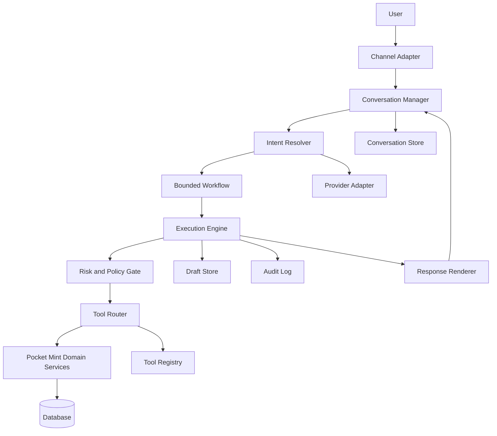

# Assistant Core Architecture

## 1. Status

Approved for architecture. Phases 21.1 (Documentation and Contracts), 21.2 (Read-Only Assistant Foundation), and 21.3 (Conversation Persistence) are implemented. This document supersedes the informal "AI Assistant" description in [System Architecture](./system-architecture.md#ai-assistant) as the single source of truth for Assistant Core. That section now points here instead of describing the boundary independently.

---

## 2. Context

Pocket Mint v0.5.0 is stable. Core Finance, Authentication, Wallets, Transactions, Categories, Monthly Category Budgeting, Saving Goals, Recurring Transactions, Notifications, Analytics v2, CSV Export, Smart Categorization, Merchant Mapping, the Rule Engine, i18n, and frontend stabilization are complete.

The product vision has extended from an expense tracker to an AI-first Personal Finance Assistant that minimizes financial friction and maximizes financial clarity. Pocket Mint remains the financial system of record; the Assistant is an interaction and orchestration layer, not an owner of financial logic.

Two independent architecture proposals were produced for Assistant Core outside this repository ("Proposal A — Pre-Assistant Core Foundations" and "Proposal B — Orchestration Architecture"). They agree on the core invariant and on most component boundaries, but each introduces terminology and detail the other does not: Proposal A defines the capability model, canonical tool contract, draft pipeline, and risk tiers; Proposal B defines the tool registry, planner, execution engine, response generation, memory model, and domain-event integration. This ADR merges both into one non-overlapping model, resolves their few terminology mismatches (e.g., "confirmation subsystem" vs. "draft state" both meant the same thing — draft state wins), and cuts scope the proposals themselves flagged as premature.

---

## 3. Product and Engineering Goals

- Let a User ask about their financial position and receive an answer derived from real backend data, not model recall.
- Let a User initiate a financial write conversationally, but never let a write commit without an explicit confirmation of a previewed effect.
- Keep the Assistant replaceable at the provider level: switching or adding an LLM vendor must not touch domain code, stored conversations, or business rules.
- Keep Assistant Core additive: no existing controller, service, or schema is modified to make the Assistant work.

## 4. Non-Goals (v1)

- Real-world money movement, bank credentials, or external payment execution.
- Autonomous multi-step planning beyond a small set of bounded, deterministic workflows.
- A general-purpose long-term memory or "world model" of the User's finances.
- Proactive, event-triggered conversation (the Assistant responds to requests; it does not yet start them).
- A standalone non-financial reminder domain.

---

## 5. Architectural Invariants

These carry over unchanged from [System Architecture](./system-architecture.md) and bind Assistant Core specifically:

```text
Assistant
    ↓
Tool Router
    ↓
Pocket Mint Domain Services
    ↓
Database
```

Never:

```text
LLM
    ↓
Database
```

- The Assistant never supplies or selects the authenticated User ID; it is resolved the same way as every other caller (`req.auth.userId` → ownership enforcement → domain service).
- The Assistant has no privileged path around authorization, Canonical Calculations, transactions, auditing, or User control.
- AI output is untrusted input. Every tool call is server-validated regardless of what the model produced.
- A financial write is never committed without going through Draft → Preview → Explicit Confirmation → Commit.
- Provider SDK types never leak past the provider adapter.

---

## 6. Final Component Model



Domain Event Subscriber is deferred (§24) and omitted from the v1 diagram.

## 7. Responsibility Boundaries

| Component | Owns | Does not own |
|---|---|---|
| Channel Adapter | Transport-level request/response for a given surface (web chat, future mobile) | Business logic, provider calls |
| Conversation Manager | Conversation lifecycle, turn sequencing, loading/saving conversation state | Tool execution, financial rules |
| Intent Resolver | Turning a message plus context into a provider-neutral intent | Database access, authorization, confirmation reduction |
| Bounded Workflow | Deterministic step sequencing for a supported intent | Autonomous planning, DB access |
| Execution Engine | Dispatch ordering, timeouts, cancellation, idempotency propagation, partial-failure reporting | Authorization decisions, tool implementation |
| Risk and Policy Gate | Deciding immediate-execute vs. draft-and-confirm based on tool risk tier and permitted preferences | Weakening mandatory system policy |
| Tool Router | The only path from Assistant Core into domain services; validates input against the canonical contract | Business logic, calculations |
| Tool Registry | Passive, deterministically-loaded catalog of tool contracts | Conversation state, execution, LLM interaction |
| Draft Store | Pending-mutation state: proposed input, preview, status, expiry | Committed financial state |
| Conversation Store | Messages, tool-call history, active draft reference | Financial facts (always re-fetched from domain) |
| Audit Log | Actor, origin, tool, input/output summary, outcome, correlation ID | — |
| Provider Adapter | Translating canonical requests/tool schemas to/from one LLM vendor's format | Any provider-neutral state |
| Response Renderer | Turning structured results into user-facing text | Tool invocation, business decisions, recomputation |
| Pocket Mint Domain Services | All Canonical Calculations, ownership, validation, atomic mutation — unchanged from [System Architecture §Business Services](./system-architecture.md) | — |

---

## 8. Canonical Tool Contract

Every tool is registered with this minimum, provider-neutral metadata:

- stable tool identifier
- description
- input schema, output schema
- capability (e.g. `transaction.read`, `transaction.create`, `budget.read`, `saving-goal.contribute`)
- risk level (§12)
- confirmation policy
- idempotency policy
- timeout
- audit metadata
- enabled/disabled state

A capability is not an independent RBAC system — it is a label on the tool contract that determines which tools a conversation may invoke. It never replaces backend ownership/authorization, which remains `req.auth.userId → ownership enforcement → domain service` exactly as today. Provider-native tool schemas are generated from this canonical contract by the provider adapter; nothing upstream of the adapter knows a provider-specific format.

## 9. Tool Registry Design

A passive, deterministically-loaded-at-startup catalog. It does not know about conversations, does not plan, does not execute, and is never modified by the LLM. For v1 it holds only the metadata in §8 — no team ownership, dynamic administration, cost accounting, or retry matrices unless a concrete tool needs them.

## 10. Intent and Orchestration Model

Natural-language input resolves to a provider-neutral intent. For v1, orchestration is deterministic and bounded per supported intent — not a general-purpose DAG planner. A workflow answers: what tools are required, in what order, and what (if anything) needs clarification before proceeding. It never touches the database directly, never recomputes a financial calculation, never bypasses the Tool Router, and never reduces confirmation requirements. General planning is introduced only when a concrete multi-tool use case demonstrates the bounded model is insufficient.

## 11. Execution Model

The Execution Engine is the only component that dispatches through the Tool Router. It handles dependency ordering, bounded parallelism, timeouts, cancellation, idempotency propagation, and retry only for explicitly retryable failures. It stops on unsafe ambiguity and reports partial success honestly rather than silently retrying an ambiguous money-affecting mutation. Multi-step mutations prefer one atomic domain-level tool over a distributed transaction across multiple tool calls; there is no cross-tool distributed transaction in this architecture.

## 12. Risk and Policy Model

Risk is static tool metadata, not a runtime inference. Four tiers:

| Tier | Examples | Execution |
|---|---|---|
| Low | balance/budget/analytics/saving-goal reads | Execute immediately, no confirmation, audited |
| Medium | create transaction, create budget, create saving goal | Draft → preview → lightweight confirmation → commit |
| High | internal transfer, edit transaction amount, archive/delete financially meaningful records, bulk import commit | Full preview, explicit confirmation, stronger policy checks, clear effect disclosure |
| Very High | bank payment, external transfer, bank login, wallet deletion with extensive history, irreversible bulk deletion | Unavailable in v1 |

Policy evaluation uses risk tier, fixed system rules, and permitted User preferences to decide execution behavior. A User preference may raise a confirmation bar; it may never lower one below system policy. Model self-reported confidence never reduces required confirmation. Risk classification and policy evaluation are one small module for v1, not two deployed subsystems — there was no requirement in either source proposal that justified splitting them.

## 13. Draft and Confirmation Lifecycle

One generic draft mechanism for every financial write, not one draft table per domain:

```text
Draft → Preview → Explicit Confirmation → Commit
```

A draft holds: conversation ID, request ID, tool identifier, validated proposed input, preview data, status, created/expiry timestamps, and a committed-resource reference once applicable. Drafts are inert — they never touch financial tables. A conversation holds at most one active draft, so confirmation is never ambiguous about what it targets. Pending confirmation *is* the draft's status; there is no separate confirmation-persistence model.

Commit requires, in order: ownership verification, draft-still-pending check, expiry check, input revalidation, execution of the existing domain service inside its existing transaction boundary, and an audit write. Preview must reuse the same domain logic as commit — it must not become a second, independently drifting implementation of a financial calculation. Not every existing service can safely support a generic dry-run; where a service cannot, the workflow computes a preview from the same validated inputs it will commit with, without inventing a parallel calculation path.

## 14. Conversation and Memory Model

Minimum memory for v1, layered:

- **Conversation memory** — current messages and references needed to resolve "that transaction" or "the BCA wallet."
- **Session state** — incomplete workflow state, active draft, clarification state.
- **Preference memory** — explicit, User-set preferences (default wallet, verbosity, reminder delivery, confirmation strength) that may only strengthen, never weaken, mandatory policy.
- **Long-term semantic memory** — deferred (§24). Merchant aliases, category rules, wallet state, saving goals, and budgets already live in the finance domain and are always fetched from there, never cached as a second source of truth in conversation memory.

## 15. Provider Adapter Boundary

```text
Provider SDK → Provider Adapter → Canonical Assistant Request / Tool Call → Assistant Core
```

Everything on the Assistant Core side of the adapter — stored conversations, messages, tool calls, execution plans, tool results, draft state, audit state — is provider-neutral. Only the adapter knows OpenAI/Anthropic/Gemini-specific message and tool formats. Swapping or adding a provider means writing one adapter; nothing else changes.

## 16. Domain-Event Integration

Deferred as an active data path in v1 (§24), but the shape is fixed now so it can be added without redesign:

```text
Domain Service → Domain Event → Event Subscriber / Intent Builder → Assistant Workflow
```

Domain events never call Assistant-specific code directly. Only an explicit allow-list of events (recurring reminder triggered, budget threshold reached, saving goal completed) would ever reach an Event Subscriber, which converts an approved event into a synthetic, provider-neutral intent and hands it to the same Bounded Workflow path an interactive request would use. Routine events (e.g. every transaction creation) never produce Assistant messages.

## 17. Auditability and Correlation Requirements

Every tool invocation is audited with actor, origin, tool identifier, input/output summary, outcome, and a correlation ID that ties one conversation turn to its resolved intent, workflow, tool calls, and (if applicable) draft/commit. This is the same auditing obligation [System Architecture §Auditing](./system-architecture.md) already places on every consequential operation — Assistant Core does not get a separate audit model.

---

## 18. Request Lifecycle

```text
Channel Adapter receives message
    → Conversation Manager loads/creates conversation
    → Intent Resolver (via Provider Adapter) resolves intent
    → Bounded Workflow selects required tool(s)
    → Execution Engine dispatches
    → Risk and Policy Gate decides immediate-execute vs. draft
    → Tool Router validates against canonical contract, calls Domain Service
    → Domain Service executes under existing authorization/transaction rules
    → Result recorded to Audit Log
    → Response Renderer produces user-facing text
    → Conversation Manager persists turn
```

## 19. Read-Only Lifecycle

```text
User asks a read-only question
    → Intent resolved
    → Risk = Low → Execution Engine calls Tool Router immediately, no draft
    → Domain Service returns data
    → Audited
    → Response Renderer explains the result
```

## 20. Financial-Write Lifecycle

```text
User expresses a write intent (e.g. "create a transaction")
    → Intent resolved, capability checked
    → Risk = Medium/High → draft created (validated proposed input + preview)
    → Preview shown to User
    → User confirms the specific draft ID
    → Commit: ownership check → pending check → expiry check → revalidate → execute domain service in its transaction → audit
    → Response Renderer confirms outcome
```

## 21. Confirmation Lifecycle

```text
Draft created (status: pending, expiry set)
    → shown to User
    → User confirms draft ID, or draft expires, or User abandons it
    → on confirm: re-verify pending + not expired + ownership → commit
    → on expiry/abandon: draft marked expired/void, no domain effect ever occurred
```

Confirmation always targets an explicit draft ID; there is no implicit "confirm the last thing I said" resolution.

## 22. Failure and Idempotency Behavior

- Tool calls carry idempotency evidence so a retried call cannot double-commit a financial effect, consistent with [System Architecture §Idempotent Operations](./system-architecture.md).
- The Execution Engine retries only failures explicitly marked retryable; it never retries an ambiguous money-affecting mutation.
- Partial multi-step failure is reported honestly to the User rather than presented as full success or silently rolled forward.
- Cross-tool operations do not use distributed transactions; where an operation is conceptually one business action, it is implemented as one atomic domain-level tool instead.

## 23. Security Considerations

- Every tool input is server-validated against its canonical schema regardless of model output; LLM output is always untrusted input.
- The Assistant never receives or sets the authenticated User ID — it is resolved the same way as any other caller.
- Draft state never becomes a bypass for authorization: commit re-verifies ownership at commit time, not just at draft-creation time.
- Context given to the provider is minimized to what a turn needs, consistent with [System Architecture §Privacy](./system-architecture.md).
- No response path exposes internal stack traces, raw provider details, or audit internals to the User.

---

## 24. Deferred Architecture

Explicitly postponed past the first Assistant release, per both source proposals:

- Separate capability service (capability stays in the tool contract/registry).
- Generic long-term semantic memory.
- A fully autonomous Goal Resolver.
- A general-purpose DAG planner (bounded, deterministic workflows only, until proven insufficient).
- A distributed event bus for domain-event integration (Postgres-backed mechanism if/when proactive workflows are built).
- Real-money payment or bank-credential capabilities (Very High risk tier, unavailable in v1).
- A standalone non-financial reminder domain.
- Frontend cache-invalidation as part of Assistant tool plans — the frontend keeps refreshing through its existing data-fetching path.
- Separate Assistant tools for derived-domain-effects (e.g. budget recalculation) unless the domain itself requires an explicit command for it.
- Proactive, event-triggered conversation (§16 defines the shape only).

## 25. Consequences and Trade-Offs

- Bounded, deterministic workflows mean some multi-tool requests will initially be handled with hand-written step sequences rather than a general planner — more workflow code per new capability, but no speculative planning infrastructure to maintain before it's needed.
- One generic draft mechanism instead of per-domain draft tables means slightly generic preview code, in exchange for not maintaining N drift-prone confirmation subsystems.
- Deferring domain-event integration means the Assistant cannot yet initiate conversation — it is reactive-only until Phase 21.6, which is an accepted trade for keeping v1 delivery small.
- Risk/policy as one module is simpler to reason about now, at the cost of a later split if policy rules grow enough to need independent deployment — acceptable since nothing today requires that separation.

---

## 26. Phase 21 Implementation Roadmap

Numbered to continue the existing [Implementation Roadmap](../development/implementation-roadmap.md) phase sequence; see that document for the authoritative phase list.

### Phase 21.1 — Documentation and Contracts

Official ADR (this document), canonical Assistant types, initial tool contract shape, risk/confirmation enums, lifecycle state definitions.

### Phase 21.2 — Read-Only Assistant Foundation

Provider-neutral Assistant boundary, one provider adapter behind an interface, Conversation Manager, Intent Resolver, Tool Registry, Tool Router, one read-only tool, deterministic response fallback, audit/correlation IDs.

First vertical slice:

```text
User asks for current monthly spending
    → Intent resolved
    → Read-only analytics tool executes
    → Structured result returned
    → Assistant explains the result
```

### Phase 21.3 — Conversation Persistence

Conversation records, message records, tool-execution records, expiration and cleanup rules.

### Phase 21.4 — First Financial Draft Flow

First write capability: `transaction.create`. Validated draft creation, preview, explicit confirmation, commit through the existing transaction service, idempotency, audit history.

### Phase 21.5 — Bounded Multi-Tool Workflows

Added only after the read and write vertical slices (21.2–21.4) are stable in production use.

### Phase 21.6 — Proactive Domain-Event Workflows

Deferred until conversational request/response behavior (21.1–21.5) is production-ready. Introduces the Domain Event Subscriber path described in §16.

---

## 27. Implementation Status (2026-07-22)

Phases 21.1 through 21.4 are implemented in `pocket-mint-be`:

- **Phase 21.1 — Documentation and Contracts:** ✅ ADR (this document), canonical types, tool contracts, registry, policy evaluator.
- **Phase 21.2 — Read-Only Assistant Foundation:** ✅ Implemented.
- **Route:** `POST /api/v1/assistant/execute` (authenticated, allow-listed intents)
- **First supported intent:** `analytics.monthly-spending-summary`
- **Deterministic renderer:** Indonesian text output
- **LLM provider:** Not yet integrated
- **Durable audit persistence:** Deferred (per ADR §17 — structured logs only)
- **Conversation persistence:** Implemented (Phase 21.3)
- **Draft/commit flow:** Implemented (Phase 21.4)

### Phase 21.4 Financial Draft Decision (2026-07-22)

`transaction.create` accepts only regular `INCOME` and `EXPENSE` inputs and initially creates a typed `AssistantFinancialDraft`; it cannot create a financial transaction. The normalized columns are transaction type, `Decimal(15,2)` amount, owner-scoped wallet/category IDs, normalized transaction date, and optional description. Arbitrary raw request JSON is not stored. Draft states are `PENDING_CONFIRMATION → COMMITTED|CANCELLED|EXPIRED|FAILED`, with a shared 15-minute expiry constant enforced at command time and no cleanup worker.

Explicit confirmation uses `POST /api/v1/assistant/drafts/:draftId/confirm` with a bounded `Idempotency-Key`. A parameterized PostgreSQL advisory transaction lock serializes each draft; `(userId, key)` is database-unique and `transactionId` is unique on the draft. The confirmation transaction creates the confirmation turn and minimized execution audit, calls the authoritative transaction service with the same Prisma transaction client, applies the wallet effect once, links the transaction, and marks the draft committed. Exact replay and a new key on a committed draft return the original transaction; key reuse across drafts conflicts. Cancellation is a separate durable turn and is idempotent only for an already-cancelled draft.

Assistant history can be deleted without cascading to finance data, while restrictive transaction foreign keys prevent deletion of an authoritative transaction that still backs a committed draft or successful idempotency record. There is no external call in the commit boundary and therefore no external crash window. An unexpected database failure rolls back the entire confirmation. A known transaction-domain rejection occurs before any financial mutation or idempotency success and is then recorded as `FAILED` in a separate transaction. If that secondary history write fails, the draft can remain pending, but the API returns no false success and performs no automatic retry; any later explicit retry remains governed by the same lifecycle and idempotency rules.

### Phase 21.3 Persistence Decision (2026-07-22)

Assistant persistence uses four provider-neutral relational records: an owned `AssistantConversation`, one `AssistantTurn` per canonical request, canonical `AssistantMessage` rows, and separate `AssistantToolExecution` audit rows. Ownership is enforced inside the conversation service with authenticated `userId`; unknown and cross-user IDs are indistinguishable.

Every persisted USER message has content, but `message` remains optional on execute requests. Whitespace-only input is absent. Original text is marked `USER_PROVIDED`; a deterministic fallback is generated only from validated arguments; rejected requests store a constant safe summary rather than raw invalid JSON. Retrieval exposes plain-text `content` and `source`. HTML, provider-native roles and payloads, hidden reasoning, request/auth objects, stack traces, and unrestricted tool results are never canonical records.

Turns follow `PENDING → RUNNING → SUCCEEDED|FAILED`, with `REJECTED` for handled validation/policy rejection. Tool records independently preserve terminal success, failure, timeout, or denial. Initial persistence failure prevents finance execution. Tool execution occurs outside database transactions; short transactions create the request records and finalize the response. A crash after a successful read but before final persistence may leave inspectable `RUNNING` records. `RUNNING` is durable execution state, not proof that a process is still active, and retrieval must not represent it as completed. The API never returns success before final persistence succeeds, does not automatically retry or rewrite a successful handler result as a failed execution, and Phase 21.3 has no stale-record detection or recovery. Correlation IDs support operational investigation without logging raw financial results. Mutation retry is forbidden until Phase 21.4 provides idempotency.

For the monthly summary, durable input is only `{ month }`; output audit data is only `{ month, transactionCount, categoryCount }`. Rendered assistant text is a historical snapshot of what the user saw and never replaces finance-domain truth.

Archival is ownership-scoped and idempotent. Automatic expiration, permanent deletion, and cleanup jobs are deferred until a retention policy is approved. The schema retains timestamps needed for that future policy.

### Usage Example

```http
POST /api/v1/assistant/execute
Authorization: Bearer <supabase-access-token>
Content-Type: application/json

{
  "intent": "analytics.monthly-spending-summary",
  "arguments": { "month": "2026-07" }
}
```

```json
{
  "success": true,
  "data": {
    "status": "success",
    "renderedText": "Pada Juli 2026, total pengeluaran kamu adalah Rp5.500.000 dari 42 transaksi.\nKategori pengeluaran terbesar adalah Makanan sebesar Rp2.000.000.\nPemasukan bulan ini Rp10.000.000 dan net savings Rp4.500.000.",
    "data": {
      "month": "2026-07",
      "totalIncome": 10000000,
      "totalExpense": 5500000,
      "netSavings": 4500000,
      "transactionCount": 42,
      "topCategories": [
        { "name": "Makanan", "amount": 2000000, "percentage": 36.36 }
      ]
    },
    "correlationId": "550e8400-e29b-41d4-a716-446655440000"
  },
  "message": "Assistant executed successfully"
}
```

This endpoint is an internal backend capability. It is not presented as a public autonomous Assistant product.

### Money Serialization Decision (2026-07-22)

Assistant v1 mirrors the existing Analytics API number serialization.

Assistant Core does not perform financial arithmetic.

Decimal-backed values are calculated by the existing domain/query services and serialized only at the application boundary via `Number(decimal.toString())` — the same convention used by `AnalyticsController` and other existing controllers.

Any future API-wide money serialization change must update Analytics and Assistant contracts together.

### Correlation Middleware (Platform Capability)

The correlation middleware (`src/http/correlation.ts`) is a **backend platform capability**, not an Assistant-local implementation detail. It is loaded globally in `src/app.ts` before all routes, and the central error handler (`src/middlewares/error.middleware.ts`) reuses the incoming correlation ID for error responses.

- Every request receives one generated UUIDv4 correlation ID.
- The same ID flows through success and error paths.
- The response header is `X-Correlation-Id`.
- Caller-supplied correlation IDs are rejected (always regenerated).
- `X-Correlation-Id` is listed in CORS `exposedHeaders` for browser client access.
- No correlation state leaks between concurrent requests.

### Timeout Behavior (Phase 21.2)

Tool execution uses `Promise.race` with a registered timeout. The timeout **stops waiting** for the handler result — it does not cancel the underlying domain operation.

The error wording accurately reflects this: "The Assistant stopped waiting for the tool result."

The timeout wrapper remains suitable only for read-only tools. Phase 21.4 mutations do not use it: confirmation is a dedicated database transaction with a required idempotency key and no automatic retry.

### Output Validation

Tool output is validated at the boundary. Non-finite values (`NaN`, `Infinity`, `-Infinity`) are rejected. `transactionCount` must be a non-negative integer. Negative monetary amounts are permitted (they follow current domain semantics).

## 28. Open Questions

None of the following block starting Phase 21.1 or 21.2; they must be resolved before the phase that depends on them:

- Which specific analytics/read tool is the first vertical slice built against (blocks 21.2 tool selection, not the boundary itself).
- Automatic cleanup cadence for terminal and expired drafts; command-time expiry enforcement is implemented with a 15-minute duration.
- Whether preference memory is persisted per-User or per-conversation in a future phase (it is not part of the Phase 21.3 schema).
- Exact allow-listed event set for §16/21.6 (blocks 21.6 only).

---

## Related Documents

- [System Architecture](./system-architecture.md)
- [Implementation Roadmap](../development/implementation-roadmap.md)
