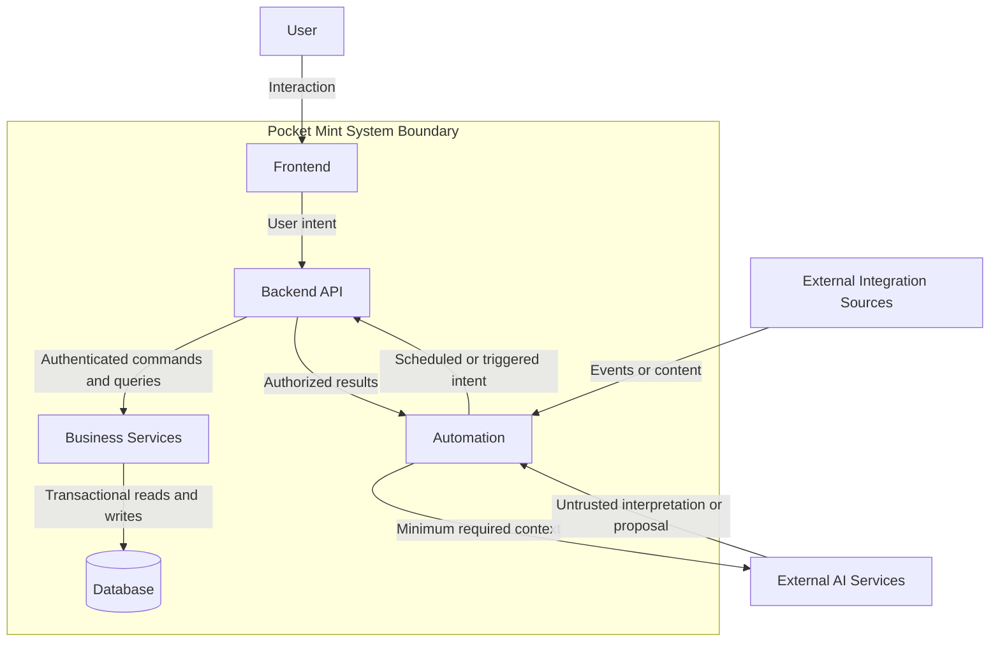
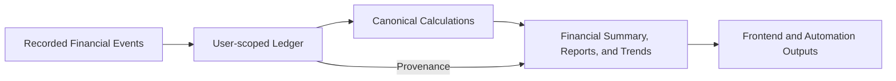
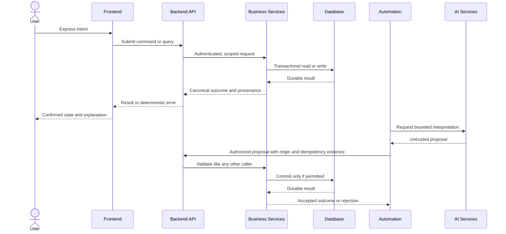
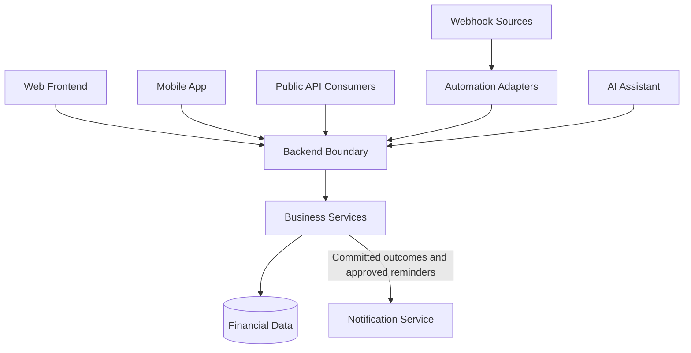

# System Overview

Pocket Mint is a privacy-first, self-hostable personal finance system that gives each authenticated User an explainable view of tracked assets, debt, Financial Events, Installments, and Reports. It records financial facts in a User-scoped Ledger and derives financial summaries from one set of Canonical Calculations.

The system boundary contains the Frontend, Backend API, Business Services, Database, and Pocket Mint-managed Automation. External AI Services and future integrations remain outside the trusted financial boundary. They may interpret inputs, request information, or propose actions, but they do not own financial truth and cannot bypass the Backend.

Pocket Mint does not move money, provide banking services, prescribe financial decisions, or infer missing financial history. Its financial position covers only information recorded in Pocket Mint.

Product policy governs architecture. PD-001, **Canonical Net Worth Definition**, and PD-002, **Owner-First Access Policy**, are Approved. PD-003 through PD-008 are Draft; architecture may support their recommended direction, but their provisional behavior must remain replaceable and must not be represented as settled policy.

---

# Architectural Principles

## Separation of Concerns

Each layer has one primary role: the Frontend presents and collects intent, the Backend API protects the system boundary, Business Services apply product rules, the Database preserves durable state, Automation coordinates approved background work, and AI Services interpret untrusted content. A layer must not absorb the responsibilities of another layer.

## Single Source of Truth

The User-scoped Ledger and its supporting records in the Database are the durable source of financial facts. Financial Summary values, balances, Reports, and Trends are derived from those facts through backend-owned Canonical Calculations. A displayed value, cached response, automation output, or AI interpretation is never an independent source of truth.

## Backend Owns Financial Logic

Business Services own all Canonical Calculations, ownership checks, lifecycle rules, validation, and financial state transitions. The same rules apply regardless of whether intent originates from the Frontend, Automation, a future mobile application, or a future public API.

## Stateless Frontend

The Frontend may hold temporary interaction state and previously confirmed responses, but it does not authoritatively own financial state. It presents backend results together with their Reporting Cutoff, collects User intent, and requests operations from the Backend.

## Deterministic Calculations

The same financial facts, policy version, Reporting Cutoff, Reporting Period, Reporting Timezone, and money precision must produce the same result. Canonical Calculations do not depend on a browser clock, server-local timezone, floating-point behavior, AI judgment, or presentation formatting.

## Explainable Data

Every Financial Event records enough context to explain what occurred. Every Derived Metric identifies its Canonical Calculation, Reporting Cutoff or Reporting Period, and supporting records. Missing information remains missing; projections, scheduled actions, and imported proposals are clearly distinguished from confirmed Ledger facts.

## Atomic Financial Change

A business operation that affects multiple records succeeds or fails as one unit. Transfers, Installment creation, corrections, and other multi-record changes must not leave a partial financial state.

## Idempotent Operations

Consequential operations are safe to retry. The Backend recognizes repeated intent and Automation identifies each scheduled or imported action uniquely so retries, catch-up processing, and duplicate delivery cannot create duplicate Financial Events or apply the same balance effect twice.

## Least Authority

Every caller receives only the access required for its responsibility. The Frontend and Automation cannot access the Database directly. AI Services receive the minimum necessary context and have no authority to confirm or persist financial changes.

## Policy Status Is Explicit

Approved Product Decisions establish binding behavior. Draft Product Decisions define provisional policy only. System boundaries should allow provisional policy to change without moving financial logic into consumers or invalidating historical explanations.

---

# High-Level Architecture

The primary request path is Frontend to Backend API to Business Services to Database. Automation enters through the same Backend boundary as every other caller. AI Services are reached only through Automation or a future backend-owned AI coordination capability; their output must pass normal validation, authorization, and confirmation rules before it can affect financial state.

This derivation path is one-way: presentation cannot redefine a calculation, a Derived Metric cannot replace its supporting Ledger facts, and a Trend cannot invent missing Historical Records.

---

# Responsibilities

## Frontend

The Frontend owns:

- Presentation, navigation, accessibility, and interaction state.
- Collection of explicit User intent and display of expected consequences before confirmation.
- Local input assistance and non-authoritative validation for usability.
- Formatting of money, dates, states, and canonical business terminology without changing their values or meanings.
- Clear separation of recorded, derived, scheduled, projected, imported, confirmed, and unavailable information.
- Display of the Reporting Cutoff, Reporting Period, or Reporting Timezone needed to interpret a value.
- Safe handling of loading, empty, partial, success, and error states.

The Frontend does not own business rules, ownership decisions, Canonical Calculations, authoritative balances, lifecycle transitions, or financial persistence.

## Backend API

The Backend API owns:

- The trusted application boundary for every interactive and automated caller.
- Authentication context, request scoping, authorization handoff, and response disclosure rules.
- Translation of caller intent into application commands and queries.
- Boundary validation, idempotency context, deterministic error contracts, and operation correlation.
- Prevention of internal domain and storage details from becoming external contracts.
- Consistent access to Business Services for the Frontend, Automation, and future clients.

The Backend API coordinates requests but does not create alternate financial rules outside Business Services.

## Business Services

Business Services own:

- Canonical domain behavior for Wallets, Financial Events, Transfers, Installments, Financial Summaries, and Reports.
- Canonical Calculations, including Net Worth, Total Assets, Total Outstanding Debt, Outstanding Balance, Available Credit, Debt Ratio, Total Obligation, Monthly Payment, and period aggregates.
- User ownership and resource-level authorization decisions.
- Validation of financial invariants and policy-dependent constraints.
- Atomic orchestration of every financial mutation.
- Lifecycle transitions, correction semantics, and preservation of explainable Historical Records.
- Generation of provenance that connects Derived Metrics to their inputs and Reporting Cutoff or Reporting Period.
- Final acceptance or rejection of requests from all callers, including Automation.

Business Services are the sole authority for financial meaning. Their responsibilities remain the same even when delivery mechanisms or storage technology change.

## Database

The Database owns:

- Durable storage of User identities as known to Pocket Mint, ownership relationships, Wallets, Categories, Financial Events, Installments, schedules, settings, and audit metadata.
- The User-scoped Ledger and Historical Records that support reproducible financial explanations.
- Transactional commit and rollback for atomic changes.
- Structural integrity, referential integrity, uniqueness, and persisted idempotency evidence.
- Exact storage of money values and timestamps required by the domain.

The Database does not define product meaning independently. Business policy is expressed by Business Services, with database constraints reinforcing invariants that can be enforced structurally.

## Automation

Automation owns:

- Coordination of approved scheduled or externally triggered work.
- Repeat-safe delivery, retry, catch-up, deduplication, and operational status for automated jobs.
- Recording the origin of imported or automated proposals.
- Requesting backend queries or commands using an explicitly authorized identity and scope.
- Presenting proposals for User confirmation when policy requires confirmation.
- Invoking AI Services with only the context necessary for an approved interpretation task.

Automation is not a financial authority. It does not access the Database directly, implement independent financial calculations, bypass backend validation, or silently convert scheduled, projected, or AI-derived information into confirmed Ledger facts. Read-only automation may produce summaries from backend results; write-capable automation must use the same command path and controls as interactive clients.

## AI Services

AI Services own only probabilistic interpretation tasks, such as extracting a proposed transaction from User-provided content or producing a natural-language explanation from approved data.

AI Services do not own:

- Authentication, authorization, or User ownership.
- Financial calculations or validation.
- Persistence, confirmation, or mutation of financial state.
- The classification of uncertain content as a confirmed Financial Event.
- Historical facts, Reports, or advice presented as deterministic truth.

AI output is untrusted input. It must carry confidence and provenance where useful, remain distinguishable from recorded facts, and be validated by the Backend before use. Consequential AI-proposed actions require the level of User control established by product policy.

The Backend prepares provider input through the Assistant Context Engine. This engine reads only an authenticated User's active conversation and derives a bounded, deterministic `AssistantContext`; it does not mutate conversation or financial state. Context contains minimized conversation history, at most one pending draft, safe tool summaries, and the explicit current request. Hidden persistence, policy, risk, correlation, audit, and reasoning data never crosses the provider boundary. Phase 21.5 exposes this only as an internal application-service method; the existing deterministic Assistant execute route does not call it. Phase 21.6 provider runtime is its first production consumer.

---

# Data Ownership

| Information or decision | Authoritative owner | Other layers |
|---|---|---|
| Ledger and Financial Events | Database, accessed through Business Services | Frontend and Automation receive scoped views; AI has no direct access |
| Wallet and Installment state | Database, interpreted by Business Services | Frontend presents; Automation may request approved transitions |
| Financial calculations and Derived Metrics | Business Services | Frontend formats; Automation reuses returned results; AI may explain but not recalculate |
| Ownership and authorization decisions | Backend API and Business Services | Frontend may hide unavailable actions but is not authoritative |
| Presentation and interaction state | Frontend | Backend supplies canonical values and states |
| Reporting Cutoff, Reporting Period, and Reporting Timezone application | Business Services using persisted settings and event times | Frontend displays; Automation schedules against backend-defined boundaries |
| Automation job state and delivery metadata | Automation, with durable evidence where required | Backend decides whether requested work is valid and idempotent |
| Imported or AI-extracted proposal | Automation until accepted | AI proposes; Backend validates; it becomes financial truth only after an approved backend operation records it |
| Assistant context | Conversation storage is authoritative; Backend Context Engine derives a request-local DTO | Provider runtime receives only bounded, redacted context and cannot write it back as financial truth |
| Audit and provenance records | Database under Business Service control | Frontend and Automation may receive authorized explanations |

Financial truth lives in persisted Ledger facts plus backend-owned Canonical Calculations. A balance or Derived Metric may be materialized for performance only if it remains reproducible from its authoritative inputs, is governed by the same write transaction, and cannot drift into a competing source of truth.

No consumer may combine values from different Reporting Cutoffs into one Financial Summary. No layer may substitute a cached, projected, scheduled, or AI-generated value for a confirmed fact.

---

# Communication

## Frontend and Backend

The Frontend sends User intent and the minimum context needed to evaluate it. The Backend authenticates the caller, scopes the operation, applies authoritative validation and business rules, and returns canonical results or deterministic errors. The Frontend may optimistically prepare an interaction, but it treats a change as confirmed only after Backend acceptance.

Queries return values with the business context needed to interpret them, including state, provenance, and time boundaries where applicable. Commands return the accepted outcome and resulting state rather than requiring the Frontend to reconstruct financial effects.

## Backend and Database

Business Services read and write data through transactional persistence boundaries. Multi-record financial operations use one atomic transaction. Reads are User-scoped and consistent with the requested Reporting Cutoff or Reporting Period. The Backend is the only application path to financial data; storage structures are not client contracts.

## Backend and Automation

The Backend exposes authorized business capabilities to Automation and provides the canonical data needed for scheduling or summaries. Automation supplies trigger identity, intended action, origin, and idempotency evidence. The Backend independently revalidates ownership, policy, current state, and financial consequences.

The Backend may publish an internal signal that work is due, or Automation may invoke the Backend on a schedule. In either direction, Automation cannot declare a financial outcome complete until the Backend commits it.

## Automation and AI

Automation sends AI Services a bounded interpretation request with minimized context. AI Services return a proposal, extraction, classification, or explanation. Automation preserves origin and uncertainty, then either presents the proposal for confirmation or submits it to an approved backend validation path. AI Services never communicate with the Database and never receive reusable authority to act as a User.

For Assistant conversations, `AssistantApplicationService.prepareProviderExecution` is the internal handoff: an unpersisted current User request plus exactly four ownership-scoped SQL reads are assembled and serialized before a future provider adapter is invoked. The current request is appended exactly once and last, with any pending draft immediately before it. Context assembly itself performs no provider call, tool call, audit write, message persistence, or financial mutation. There is no public context endpoint.

---

# Cross-Cutting Concerns

## Authentication

Authentication establishes a verified User identity before access to every user-financial capability. An uninitialized installation exposes only a narrowly scoped first-Owner initialization path; after initialization, public self-registration is prohibited and additional Users require explicit Owner approval through an invitation or allowlist. Non-financial landing content, first-Owner initialization while uninitialized, authentication, approved authentication callbacks, invitation or allowlist admission completion, account recovery, and minimal health capabilities may remain public. These public capabilities remain separate from authenticated financial access and disclose no private financial information or unnecessary account, invitation, or resource existence.

## Authorization

Authorization is enforced in the Backend for every financial query and mutation. Every resource operation is scoped to the requesting User. Owner authority applies only to installation-level admission and settings; it cannot bypass User resource isolation, impersonate another User, or authorize access to another User's financial information. Automation and service identities require explicit authorization and narrowly defined User scope through the same Backend boundary. Lack of access must not reveal another User's account, resource, or financial information.

## Validation

The Frontend validates for usability; the Backend validates for truth. Business Services validate ownership, state transitions, money constraints, dates, and cross-resource invariants for every caller. Automation and AI-originated input receive no exception.

## Transactions

All multi-record financial mutations are atomic. A Transfer applies both wallet effects or neither. Installment creation records its obligation and related financial effects once. Failures roll back the entire operation, and retries are governed by idempotency rather than partial recovery in the Frontend.

## Logging

Operational logs identify requests, jobs, failures, retries, and correlations without becoming a financial system of record. Logs minimize private financial content and credentials, apply access controls and retention policy, and never substitute for audit or Ledger records.

## Error Handling

Errors are deterministic, safe to expose, and classified by business meaning. They distinguish unavailable data from zero values, rejection from system failure, and unknown outcomes from confirmed rollback. Partial report failures identify affected sections without combining incomplete values into a complete Financial Summary.

## Auditing

Consequential operations record actor, origin, time, affected business concept, and outcome. Imported and automated records retain their origin and confirmation state. Corrections preserve an explainable Historical Record according to approved policy; unresolved deletion and lifecycle policies must not be assumed by architecture consumers.

## Timezones

Financial period boundaries and scheduled processing use one persisted Reporting Timezone, provisionally governed by PD-003. Browser-local and server-local timezones are presentation or operational concerns, not financial authority. Financial Events retain an unambiguous instant, while the Backend determines their Reporting Period and due-date meaning.

## Money Precision

Money uses an exact decimal representation across validation, calculation, persistence, and authoritative communication. Binary floating-point arithmetic is prohibited for financial decisions. Rounding occurs only under an explicit Canonical Calculation, and presentation formatting never changes the recorded or calculated value.

## Privacy

Private financial information remains inside the smallest practical trust boundary. Data disclosed to Automation, notifications, AI Services, webhooks, or future clients is minimized, User-scoped, purpose-bound, and auditable. Sensitive values and credentials are not placed in general operational logs.

## Observability and Reliability

The system exposes health, correlation, job status, retry state, and failure signals without exposing private financial data. Availability problems must not be represented as empty financial history, and delayed Automation must use idempotent catch-up rather than silently skipping or duplicating work.

---

# Future Architecture

## Webhooks

Inbound webhooks integrate through an authenticated or cryptographically verified adapter at the Automation boundary. They are deduplicated, recorded with origin, and translated into backend commands or proposals. Outbound webhooks contain only authorized data and describe committed backend outcomes; delivery failure does not roll back an already committed financial operation.

## Mobile App

A mobile application is another Frontend. It uses the same Backend API, canonical terminology, authorization, and Business Services as the primary Frontend. It may cache read models for resilience, but it cannot establish a separate financial rule set or local source of truth.

## Public API

A future public API is an additional controlled entry point to the Backend, not direct access to Business Services or the Database. It requires explicit scopes, stable business contracts, rate controls, idempotency for mutations, and the same ownership and validation rules as first-party clients.

## Notification Service

A Notification Service consumes committed outcomes and approved reminder signals. It owns channel delivery, preferences, retries, and delivery status, but not the financial condition that triggered a notification. Notifications link back to authoritative Pocket Mint information and distinguish reminders or projections from recorded facts.

## AI Assistant

An AI Assistant combines a conversational Frontend with a backend-owned coordination boundary. It may query authorized, minimized read models and explain backend-provided calculations. Any proposed mutation is structured, validated, shown with its consequence, and confirmed according to product policy before Business Services commit it. The assistant cannot answer missing-history questions by inventing records or present general model output as financial advice or canonical truth.

The first implemented mutation flow stages `transaction.create` as a durable 15-minute draft. Only a separate authenticated confirmation with a database-backed idempotency key may invoke the existing Transaction Service; cancellation and expiration have no ledger or wallet effect. The Assistant stores lifecycle/audit summaries, while Transaction and Wallet records remain authoritative.

The full component model, lifecycles, phased roadmap, and current implementation status for this boundary are defined in [Assistant Core Architecture](./assistant-core-architecture.md), which is now the authoritative reference for Assistant Core.

## Additional Automation Integrations

Message parsers, workflow tools, importers, and schedulers integrate as Automation adapters. Each adapter identifies its origin, uses least authority, and delegates validation and financial effects to the Backend. New integrations extend delivery and interpretation capabilities without duplicating domain behavior.

All future additions converge on the same Backend boundary and Business Services. None receives a privileged path around authorization, Canonical Calculations, transactions, auditing, or User control.

---

# Architectural Constraints

- Business rules and Canonical Calculations never belong in the Frontend, Automation, AI prompts, notification templates, or integration adapters.
- The Frontend never accesses the Database directly.
- Automation and AI Services never access the Database directly.
- Every financial query and mutation passes through authenticated, User-scoped Backend controls.
- Automation cannot bypass validation, authorization, idempotency, transactions, or required User confirmation.
- AI output is never treated as confirmed financial truth without backend validation and the required User control.
- Money calculations never occur inside UI components or presentation formatters.
- Binary floating-point values are never authoritative inputs to financial decisions.
- A financial operation that affects multiple records never commits partially.
- Transfers are neither Income nor Expense and must not create or remove value from the tracked financial position.
- An Installment Total Obligation affects its Debt Wallet once; later Installment Payments cannot apply the same debt effect again.
- A Derived Metric never becomes an independent fact that can drift from its Ledger inputs.
- Values from different Reporting Cutoffs are never combined into one Financial Summary.
- Trends use consecutive Ledger-derived Historical Records; missing history is shown as a gap.
- Scheduled, Projected, Imported, Confirmed, and Paid states remain distinct.
- Cached data always retains the context needed to identify its age and Reporting Cutoff.
- Errors, logs, notifications, and AI context do not disclose another User's existence or financial information.
- Draft Product Decisions are not presented as approved behavior.
- Delivery technologies, storage products, and framework choices must remain replaceable without changing these ownership boundaries.

---

# Related Documents

- [Assistant Core Architecture](./assistant-core-architecture.md)
- [Pocket Mint Vision](../product/vision.md)
- [Product RFC](../product/product-rfc.md)
- [Canonical Glossary](../product/glossary.md)
- [Design System](../product/design-system.md)
- [Screen Specification](../product/screen-spec.md)
- [Product Decisions](../product/decisions/)
- [Implementation Reconciliation Report](../development/reconciliation-report.md)

The document authority order is defined by the Vision. Approved higher-level product documentation governs this architecture. Draft Product Decisions remain provisional until approved, and implementation evidence does not silently override product authority.
